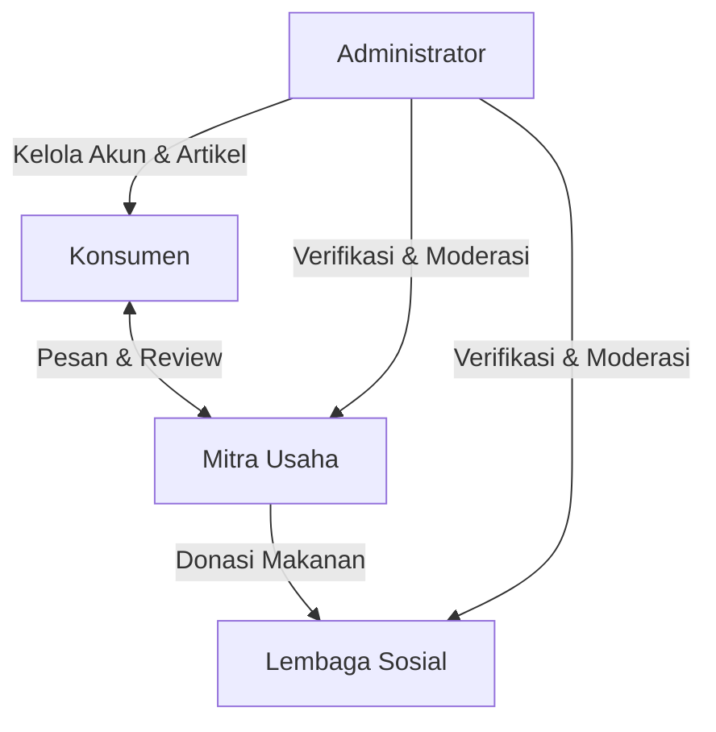

<p align="center">
  
</p>

# ShareMeal: Platform Penyelamat Food Waste & Penguat Ketahanan Pangan

[](https://laravel.com)
[](https://vitejs.dev)
[](https://tailwindcss.com)
[](https://alpinejs.dev)

**ShareMeal** adalah platform digital berbasis web yang dirancang khusus untuk mengatasi isu sampah makanan (food waste) sekaligus memperkuat ketahanan pangan (food security). Platform ini menghubungkan bisnis kuliner (restoran, toko roti, kafe) yang memiliki makanan surplus layak konsumsi dengan konsumen yang ingin membelinya dengan harga diskon, serta lembaga sosial (LSM, panti asuhan, yayasan) yang menyalurkan donasi makanan secara transparan dan efisien.

---

## Tampilan Platform

<p align="center">
  
</p>

---

## Alur Kerja Sistem (System Roles)

Sistem ini didukung oleh 4 tingkatan peran (role-based access control) yang terintegrasi:



---

## Fitur Utama Berdasarkan Peran

### 1. Konsumen (Consumer)
Konsumen dapat menyelamatkan makanan surplus berkualitas dengan harga terjangkau:
*   **Impact Dashboard:** Statistik dampak individu seperti porsi makanan terselamatkan, total uang dihemat, estimasi pengurangan emisi CO2, dan daftar toko favorit.
*   **Critical Alert:** Peringatan langsung di dashboard saat pesanan aktif sedang dikirim (Shipping) untuk dipantau secara real-time.
*   **Filter Pencarian Toko:** Menemukan mitra resto berdasarkan filter khusus: Halal, Bakery, Healthy, dan Indonesian.
*   **Cart Reservation & Stock Lock:** Sistem keranjang yang mengunci stok makanan selama 5 menit untuk menghindari rebutan stok (double ordering).
*   **Sistem Checkout Fleksibel:**
    *   Mendukung opsi Ambil Sendiri (Pickup) atau Diantar (Delivery).
    *   Pemilihan slot waktu pengantaran per 1 jam yang disesuaikan kapasitas pengiriman mitra.
*   **Pembayaran Digital:** Pembayaran simulasi QRIS, GoPay, OVO, dan DANA.
*   **Review & Rating:** Konsumen dapat memberikan ulasan untuk pesanan selesai, dengan aturan ulasan hanya dapat diedit atau dihapus dalam waktu 2 menit setelah dikirim.
*   **Problem Report:** Melaporkan jika menerima makanan bermasalah (kedaluwarsa, kualitas buruk, porsi salah) dengan menyertakan bukti foto langsung ke admin.
*   **Eco-Education:** Membaca artikel pencegahan food waste dengan sistem poin/gamification (Level Eco-Warrior).

### 2. Mitra Usaha (Merchant / Store)
Pemilik usaha makanan yang ingin menekan kerugian dari produk yang tidak terjual:
*   **Dashboard Performa Bisnis:** Menampilkan total produk, total pendapatan, porsi terselamatkan, jumlah donasi terdistribusi, rating ulasan, serta daftar pesanan masuk.
*   **Peringatan Operasional (Critical Alert):**
    *   Notifikasi darurat jika ada produk yang mendekati masa kedaluwarsa (< 4 jam).
    *   Notifikasi stok menipis (< 5 porsi).
*   **Profil Usaha & KYB:** Melengkapi data bisnis, jam buka, biaya kirim, dan mengunggah dokumen legalitas (SIUP, NIB, KTP, Halal) untuk diverifikasi oleh admin.
*   **Manajemen Produk:** Kelola menu dengan penentuan tanggal/jam kedaluwarsa.
*   **Flash Sale & Toggle Donation:**
    *   Mengaktifkan harga diskon instan (Flash Sale).
    *   Mengubah produk sisa komersial menjadi donasi gratis secara cepat (Toggle Donation).
*   **Pengelolaan Pesanan:** Menerima, memproses, mengubah status pesanan, menunda pesanan (delay order) dengan menyertakan alasan operasional, serta memvalidasi kode pengambilan (pickup code).
*   **Pengelolaan Donasi:** Membuat slot donasi makanan manual lengkap dengan kuantitas, unit (pcs/kg/box), jam penjemputan, dan memantau status pengambilan oleh lembaga sosial.

### 3. Lembaga Sosial (Social Organization / NGO)
Pihak terverifikasi yang mengorganisir penyaluran makanan donasi kepada kelompok rentan:
*   **Dashboard Penyaluran:** Menampilkan total donasi terselamatkan, jumlah donasi aktif, penerima manfaat (beneficiaries count), serta donasi yang tersedia untuk diklaim.
*   **Klaim Donasi:** Mengklaim donasi makanan yang tersedia dari mitra resto terdekat dengan menyertakan waktu penjemputan.
*   **Critical Alert:** Peringatan darurat apabila donasi yang diklaim telah berstatus "Siap Diambil" agar segera dijemput.
*   **Laporan Masalah Donasi:** Melaporkan kepada admin jika makanan donasi yang diterima tidak layak konsumsi.

### 4. Administrator (Admin Platform)
Pengelola pusat yang memoderasi platform untuk memastikan keamanan dan integritas ekosistem:
*   **Dashboard Analitik:** Memantau statistik user, total transaksi, GMV platform, pengurangan CO2, dan grafik aktivitas log terbaru.
*   **Verifikasi Akun (KYB Verification):** Meninjau berkas pendaftaran Mitra Usaha dan Lembaga Sosial. Admin dapat menyetujui (Approve) or menolak (Reject) pendaftaran disertai alasan penolakan.
*   **Manajemen Pengguna:** Tindakan penertiban seperti memberikan peringatan resmi (Warnings), membekukan akun (Block), or membuka blokir (Unblock).
*   **Penyelesaian Laporan Masalah (Problem Report Moderation):** Memeriksa laporan masalah dari Konsumen/Lembaga Sosial dengan opsi mengabaikan (Dismiss), memberikan peringatan ke mitra (Warn Mitra), or memblokir mitra (Block Mitra).
*   **Platform Feedback Management:** Mengelola keluhan/saran performa platform dari semua pengguna (ditandai Resolved/Pending).
*   **Ekspor Data:** Eksport data transaksi platform (CSV) dan ekspor laporan penyaluran dampak donasi (Excel & PDF) untuk kebutuhan pelaporan dampak eksternal.
*   **Log Audit Keamanan (Admin Logs):** Semua aksi admin tercatat secara otomatis lengkap dengan detail aksi, target, timestamp, dan IP address untuk kepatuhan keamanan.

---

## Fitur Inovasi Teknologi (Core Tech Innovations)

*   **Sistem Donasi Otomatis (Auto Donation System):** Jika sebuah produk tergolong donatable (dapat didonasikan) dan masa kedaluwarsa tersisa kurang dari 2 jam (expires_at <= now() + 2 jam), sistem secara otomatis memindahkan stok produk dari marketplace komersial ke status donasi, serta mengirimkan notifikasi real-time kepada Lembaga Sosial terdekat untuk diselamatkan.
*   **Cart Reservation & Stock Lock:** Ketika produk dimasukkan ke dalam keranjang belanja, stok asli pada database langsung berkurang dengan batas waktu reservasi selama 5 menit. Jika checkout tidak dilakukan dalam 5 menit, sistem secara otomatis mengembalikan stok ke inventori toko.
*   **Delivery Time Slot & Hourly Capacity Cap:** Pencegahan overload logistik kurir dengan membatasi jumlah pengiriman maksimum yang diperbolehkan per jam operasional restoran.
*   **Sistem Notifikasi Terpusat:** Didukung oleh 23 sistem notifikasi terintegrasi (email & in-app) yang mendeteksi perubahan status pesanan, donasi, laporan, kedaluwarsa produk, dan verifikasi akun.

---

## Teknologi yang Digunakan (Tech Stack)

*   **Backend Framework:** Laravel (PHP 8.2+)
*   **Frontend Library:** TailwindCSS, Alpine.js (Untuk reaktivitas UI instan)
*   **Database:** MySQL / SQLite
*   **Bundler & Assets Compiler:** Vite
*   **Broadcasting/Real-time Engine:** Laravel Event Broadcasting

---

## Cara Menjalankan Proyek (Local Installation)

1.  **Clone Repositori:**
    ```bash
    git clone https://github.com/ShareMeal-PPL-KelC/ShareMeal_NEW.git
    cd ShareMeal_NEW/ShareMeal
    ```

2.  **Instalasi Dependensi PHP:**
    ```bash
    composer install
    ```

3.  **Instalasi Dependensi JavaScript:**
    ```bash
    npm install
    ```

4.  **Konfigurasi Environment:**
    Salin file `.env.example` menjadi `.env` dan konfigurasikan koneksi database Anda.
    ```bash
    cp .env.example .env
    php artisan key:generate
    ```

5.  **Migrasi & Seed Database:**
    Jalankan migrasi database beserta data dummy seed awal untuk akun tes.
    ```bash
    php artisan migrate --seed
    ```

6.  **Jalankan Vite Server (Asset compiler):**
    ```bash
    npm run dev
    ```

7.  **Jalankan Laravel Dev Server:**
    ```bash
    php artisan serve
    ```
    Buka `http://localhost:8000` pada browser Anda.